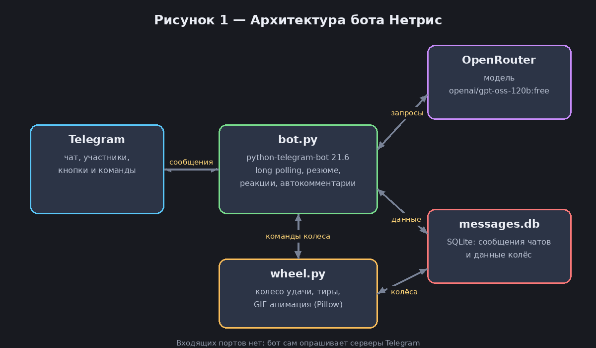

# 🎡 Нетрис — бот, который пересказывает чат и крутит колесо удачи


> Не успел прочитать 400 сообщений? Спроси Нетриса. Не можете выбрать, во что играть? Крутите колесо.

**Нетрис** (`@netrys_bot`) — Telegram-бот для групповых чатов. Он запоминает переписку и по запросу делает краткое резюме с помощью нейросети. А ещё в нём есть колесо удачи с тир-листом: чем выше пункт в рейтинге, тем чаще он выпадает.

**Разделы документации:**
[🏠 Главная](README.md) |
[🚀 Быстрый старт](docs/quick-start.md) |
[🛠 Установка и настройка](docs/installation.md) |
[📖 Руководство пользователя](docs/user-guide.md) |
[📚 Справка](docs/reference.md) |
[❓ FAQ и неисправности](docs/faq.md)

---

## ✨ Что умеет

| Возможность | Команда | Что получится |
|---|---|---|
| 📋 Резюме чата | `/summary` | Пересказ за N сообщений или за N часов: обычный, тезисами или кратко |
| 🎡 Колесо удачи | `/wheel`, `/spin` | Анимация колеса и результат с шансом выпадения |
| 📋 Тир-лист | `/tierlist` | Все пункты колеса по тирам и шанс каждого |
| ➕ Свои пункты | `/addgame` | Один пункт или целый список за раз |
| ⚖️ Свои коэффициенты и лимиты | `/setweights` | Колесо под свои правила, не только для игр |
| 📉 Спад шанса | `/setdecay` | На сколько процентных пунктов падает шанс пункта после каждого выпадения |
| 🧹 Очистка статистики | `/clearstats` | История и топ выпадений выбранного колеса |
| 🔀 Несколько колёс | `/newwheel`, `/wheels` | Отдельные колёса в одном чате: игры, фильмы, что угодно |
| 🎰 Режим колеса | `/setmode` | Слоты («Да ×2», выпало — слот убрался) или тир-лист с лимитами и спадом шанса |
| 💬 Реакции | сам | Отвечает, когда к нему обращаются (в ответ на сообщение бота или по упоминанию) |

В меню команд Telegram показаны только `/start` (запуск) и `/help` (полный список команд и возможностей). Остальные команды работают, просто не засоряют меню.

## 🧭 Как это устроено

Бот работает на Python и общается с Telegram через long polling, поэтому открывать порты на сервере не нужно. Сообщения чатов и данные колёс лежат в локальной базе SQLite, а для резюме и реплик бот обращается к нейросети через OpenRouter.



*Рисунок 1 — Архитектура бота. Подробнее о составе и настройке: [Установка и настройка](docs/installation.md).*

## 🎡 Колесо удачи

Каждому пункту колеса достаётся доля сектора, пропорциональная коэффициенту его тира. Так выглядит колесо Jackbox, которое создаётся в каждом чате при первом обращении:


*Рисунок 2 — Колесо Jackbox. Стрелка сверху показывает выпавший пункт.*

Стартовый тир-лист друзей и шансы в начале вечера (для полного колеса из 29 игр):

| Тир | Коэффициент | Лимит за вечер | Игр | Шанс одной игры | Шанс тира |
|---|---|---|---|---|---|
| 🐐 GOAT | 16 | 5 | 2 | 11,1% | 22,2% |
| 🔥 Peak | 8 | 4 | 7 | 5,6% | 38,9% |
| 👌 Mid | 4 | 3 | 9 | 2,8% | 25,0% |
| 😐 Meh | 2 | 2 | 9 | 1,4% | 12,5% |
| 💩 Slop | 1 | 1 | 2 | 0,7% | 1,4% |

Шанс пункта меняется по ходу вечера. После каждого выпадения он падает на *n* процентных пунктов от исходного (по умолчанию *n* = 20, меняется командой `/setdecay`) и не опускается ниже нуля: при *n* = 20 игра получает 100% → 80% → 60% → 40% от своего исходного шанса. Кроме того, у каждого тира есть лимит выпадений за вечер (по умолчанию 5/4/3/2/1 для GOAT/Peak/Mid/Meh/Slop; задаётся в `/setweights` в формате `GOAT=16/5`). Когда лимит исчерпан, игра до конца вечера выпасть не может.

У колёс, созданных через `/newwheel`, по умолчанию включён режим **слотов**: пункт можно добавить несколько раз (`Да ×2`, `Нет ×2`). После каждого выпадения у пункта убирается один слот, и шансы пересчитываются: из 2 «да» и 2 «нет» после «да» остаётся 1 «да» и 2 «нет», то есть 33% на 67%. На гифке каждый слот рисуется отдельным сектором, число слотов можно менять кнопками в «✏️ Управление». Режим переключается командой `/setmode`; лимиты и спад шанса действуют только в режиме тир-листа.

После прокрутки бот оставляет гифку и результат в чате до следующей прокрутки того же колеса, тогда прошлые сообщения удаляются (для этого боту нужно право «Удалять сообщения»).

Кнопка «Новый вечер» (`/newevening`) возвращает все шансы к исходным. Новый круг начинается и сам, когда лимит исчерпан у всех пунктов. Историю и топ выпадений очищает `/clearstats`: бот спрашивает, какое колесо чистить, и просит подтверждение. Текущие шансы эта команда не трогает. Коэффициенты, лимиты и тиры можно менять: см. [Справку](docs/reference.md#коэффициенты-и-шансы).

## 🚀 Попробовать за пять минут

```bash
git clone git@github.com:Netry07/netrys-bot.git
cd netrys-bot
python3 -m venv .venv && source .venv/bin/activate
pip install -r requirements.txt
```

Дальше нужны токен бота и ключ OpenRouter. Пошаговая инструкция с проверкой каждого шага: [🚀 Быстрый старт](docs/quick-start.md).

## 📁 Структура репозитория

```text
netrys-bot/
├── bot.py              # резюме, реакции, автокомментарии, запуск
├── wheel.py            # колесо удачи: тиры, слоты, коэффициенты, анимация
├── assets/             # картинки, которые бот отправляет сам
├── requirements.txt    # зависимости
├── README.md           # эта страница
└── docs/
    ├── quick-start.md
    ├── installation.md
    ├── user-guide.md
    ├── reference.md
    ├── faq.md
    └── images/         # схемы и иллюстрации
```

## 🔒 Приватность

> ⚠️ **Важно:** бот сохраняет текст обычных сообщений чата (до 1000 последних на чат) в локальную базу `messages.db`. Для резюме выбранные сообщения вместе с именами авторов отправляются во внешний сервис OpenRouter. Предупредите участников чата об этом, прежде чем добавлять бота.

Подробности о хранении данных: [Справка → База данных](docs/reference.md#база-данных).

## 🧰 Стек

- Python 3.10+
- [python-telegram-bot](https://github.com/python-telegram-bot/python-telegram-bot) 21.6
- OpenAI SDK, подключённый к OpenRouter (модель `openai/gpt-oss-120b:free`)
- Pillow для рисования колеса
- SQLite
