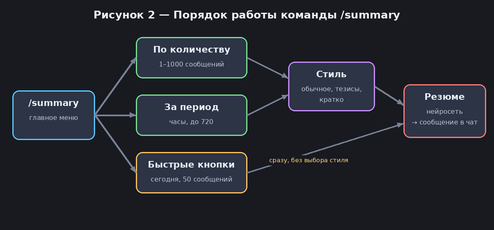
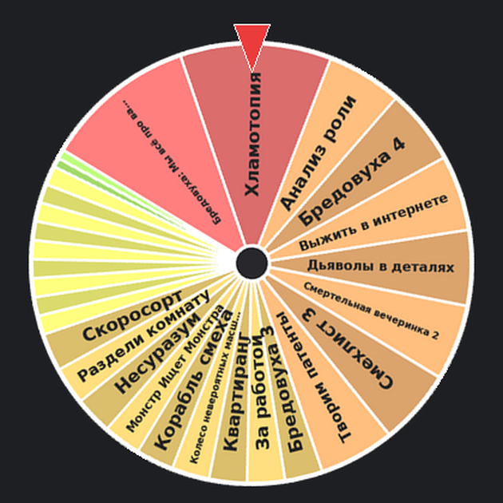

# 📖 Руководство пользователя

**Разделы документации:**
[🏠 Главная](../README.md) |
[🚀 Быстрый старт](quick-start.md) |
[🛠 Установка](installation.md) |
[📖 Руководство](user-guide.md) |
[📚 Справка](reference.md) |
[❓ FAQ](faq.md)

---

**Содержание**

1. [Назначение](#назначение)
2. [Условия](#условия)
3. [Начало работы](#начало-работы)
4. [Резюме переписки](#резюме-переписки)
5. [Колесо удачи](#колесо-удачи)
6. [Как бот реагирует сам](#как-бот-реагирует-сам)
7. [Сообщения бота](#сообщения-бота)

## Назначение

Нетрис помогает участникам чата в двух задачах:

- быстро узнать, о чём говорили, не читая всю переписку (резюме);
- решить, во что играть или что выбрать, честным и весёлым способом (колесо удачи).

Страница написана для обычных участников чата. Установка бота описана в разделе [Установка и настройка](installation.md), полный список команд — в [Справке](reference.md).

## Условия

> **Условие:** бот добавлен в чат, а администратор отключил ему режим приватности (иначе бот не видит сообщения группы). Как это сделать — в [Быстром старте](quick-start.md#шаг-6-добавьте-бота-в-чат).

- Резюме строится только по сообщениям, которые бот успел увидеть и сохранить с момента добавления в чат. Он помнит до 1000 последних текстовых сообщений.
- Команды работают и в группе, и в личной переписке с ботом.
- В группе можно писать команды с именем бота, например `/wheel@netrys_bot`, если в чате несколько ботов.

## Начало работы

1. Отправьте `/start`.

   **Результат:** бот пришлёт приветствие и список команд.
2. Отправьте `/count`.

   **Результат:** бот ответит, сколько сообщений запомнил, например «📊 Запомнено сообщений: 128 (макс. 1000)».

## Резюме переписки

Порядок работы команды `/summary` показан на рисунке 2.



*Рисунок 2 — Порядок работы команды `/summary`.*

<!-- 📸 Сюда можно добавить скриншот меню /summary: docs/images/summary-menu.png -->

### Резюме за N последних сообщений

1. Отправьте `/summary` и нажмите «📝 По количеству сообщений».

   **Результат:** бот попросит ввести число от 1 до 1000.
2. Напишите число, например `100`.

   **Результат:** бот ответит «✅ 100 сообщений. Выбери стиль:» и покажет три кнопки.
3. Выберите стиль: «📄 Обычное», «• Тезисами» или «≡ Кратко».

   **Результат:** бот напишет «⏳ Запрос в обработке, подожди...», а затем пришлёт сообщение «📋 Резюме 100 сообщений …» с пересказом.

### Резюме за период

1. Отправьте `/summary` и нажмите «🕐 За период (часы)».

   **Результат:** бот попросит ввести количество часов.
2. Напишите число часов, например `6` или `1,5`.

   **Результат:** бот ответит «✅ За последние 6ч. Выбери стиль:».
3. Выберите стиль так же, как в предыдущей инструкции.

   **Результат:** придёт резюме сообщений за выбранный период.

### Быстрые кнопки

В меню `/summary` есть кнопки, которые сразу делают резюме без дополнительных вопросов:

| Кнопка | Что делает |
|---|---|
| 📅 За сегодня | Обычное резюме с начала текущих суток (до 500 сообщений) |
| 📅 Сегодня • тезисы | То же, но тезисами |
| 📅 Сегодня ≡ кратко | То же, но кратко (3–4 предложения) |
| 📝 50 сообщений | Обычное резюме последних 50 сообщений |

Чтобы выйти из диалога на любом шаге, отправьте `/cancel`.

> ℹ️ «Сегодня» отсчитывается по времени сервера, на котором работает бот.

## Колесо удачи

В каждом чате есть своё колесо «Jackbox» с тир-листом игр. Можно создавать и другие колёса.

### Покрутить колесо

1. Отправьте `/wheel`.

   **Результат:** бот покажет меню колеса с кнопками.
2. Нажмите «🎡 Крутить колесо» (или отправьте `/spin`).

   **Результат:** придёт анимация вращающегося колеса, а через пару секунд сообщение «🎡 Jackbox — выпало: …» с названием игры, тиром и шансом выпадения.
3. Если результат не подходит, нажмите «🔁 Крутить заново». Если всех устраивает, нажмите «✅ Играем!».

   **Результат:** для переброса в группе нужно набрать 2 голоса разных участников (счётчик показан на кнопке), в личной переписке достаточно одного. После переброса выпавший пункт возвращается в колесо.



*Рисунок 3 — Колесо с играми. Размер сектора зависит от тира пункта.*

Выпавший пункт на время исключается из колеса, поэтому за вечер игры не повторяются. Чтобы начать заново, нажмите «♻️ Новый вечер» или отправьте `/newevening`. Если выпали все пункты, новый круг начнётся автоматически.

### Посмотреть тир-лист и шансы

Отправьте `/tierlist` или нажмите «📋 Тир-лист».

**Результат:** бот пришлёт список пунктов по тирам. У каждого тира указаны коэффициент и шанс на один пункт. Уже выпавшие пункты помечены.

### Добавить пункты

1. Отправьте `/addgame` или нажмите «➕ Добавить».

   **Результат:** бот попросит прислать название или список.
2. Напишите одно название или сразу несколько, каждое с новой строки:
   ```text
   Дюна
   Матрица | Хит
   Титаник
   ```
   Чтобы сразу указать тир, добавьте его после вертикальной черты.

   **Результат:** если у колеса один тир или тир указан у каждой строки, бот сразу ответит «✅ Добавлено (N): …». Если у некоторых строк тира нет, бот спросит кнопками, в какой тир положить остальные.

Можно написать всё одной командой: `/addgame Дюна | Хит`. Добавленные ранее названия бот пропустит и сообщит об этом.

### Перенести или удалить пункт

1. Нажмите «✏️ Управление» в меню `/wheel` и выберите пункт.

   **Результат:** откроется карточка пункта с текущим тиром и шансом.
2. Нажмите на нужный тир, чтобы перенести пункт, или «🗑 Удалить» и подтвердите.

   **Результат:** карточка обновится (при переносе) или пункт исчезнет из списка (при удалении).

### Настроить коэффициенты

Коэффициент задаёт, насколько часто выпадают пункты тира: пункт с коэффициентом 8 выпадает вдвое чаще, чем с 4.

1. Отправьте `/weights` и нажмите «✏️ Изменить» (или сразу `/setweights`).

   **Результат:** бот покажет текущие тиры и коэффициенты и попросит прислать новые.
2. Пришлите тиры по порядку, от лучшего к худшему:
   ```text
   Хит=10, Норм=2, Плохо=0.5
   ```

   **Результат:** бот ответит «✅ Готово!» и покажет новые коэффициенты.

Тир нельзя убрать, пока в нём есть пункты: сначала перенесите их в другой тир.

### Создать своё колесо

1. Отправьте `/newwheel Фильмы` (или нажмите «🔀 Колёса» → «🆕 Новое колесо»).

   **Результат:** колесо «Фильмы» создано и стало активным. По умолчанию у него один тир с одинаковыми шансами для всех пунктов.
2. Добавьте пункты через `/addgame` и при желании настройте тиры через `/setweights`.
3. Переключайтесь между колёсами командой `/wheels`. Покрутить другое колесо, не переключая текущее, можно командой `/spin Фильмы`.

### Статистика

Отправьте `/wheelstats`.

**Результат:** бот покажет число принятых результатов, пять самых частых пунктов и последние пять розыгрышей с именами.

## Как бот реагирует сам

- **На обращение к нему.** Если ответить на сообщение бота или упомянуть `@netrys_bot` в тексте, бот определит тон сообщения. На благодарность ответит тепло и с юмором, на грубость может ответить резко и с сарказмом (в том числе с ненормативной лексикой), на нейтральные сообщения не отвечает.
- **Раз в 50 сообщений.** Бот читает последние 10 сообщений чата и вставляет короткий комментарий с пометкой «💬».

## Сообщения бота

### Резюме

| Сообщение | Что значит | Что делать |
|---|---|---|
| «⚠️ Введи число от 1 до 1000:» | Введено не число или число вне диапазона | Напишите целое число от 1 до 1000 |
| «⚠️ Введи число часов от 0.5 до 720:» | Введено не число или число вне диапазона | Напишите число часов, например `6` или `1,5` |
| «⏳ Запрос в обработке, подожди...» | Нейросеть готовит резюме | Подождите, обычно это занимает несколько секунд |
| «📭 Нет сообщений … Напиши что-нибудь в чате!» | За выбранный период бот ничего не запомнил | Выберите больший период или напишите в чат что-нибудь и повторите |
| «❌ Не удалось получить суммаризацию. Попробуй позже.» | Сервис нейросети недоступен или перегружен | Повторите запрос через несколько минут, при повторных сбоях сообщите администратору |
| «❌ Отменено.» | Диалог прерван командой `/cancel` | Начните заново командой `/summary` |

### Колесо

| Сообщение | Что значит | Что делать |
|---|---|---|
| «🎡 Колесо уже крутится, дождись результата!» | Предыдущее кручение ещё не закончилось | Подождите несколько секунд |
| «В колесе «…» пока нет пунктов. Добавь: /addgame» | Колесо пустое | Добавьте пункты командой `/addgame` |
| «♻️ Все пункты уже выпадали — начинаем новый круг!» | Выпали все пункты колеса | Ничего, колесо уже сброшено |
| «⚠️ Не нашёл ни одного названия. Пришли ещё раз или /cancel.» | В присланном тексте нет названий | Пришлите названия по одному на строке или отмените `/cancel` |
| «↪️ Уже были (N): …» | Эти пункты уже есть в колесе | Ничего, дубликаты не добавляются |
| «⚠️ Пропущено: …» | Строки с ошибкой: неизвестный тир, слишком длинное название | Исправьте указанные строки и пришлите их заново |
| «Нельзя убрать тиры, в которых есть пункты: …» | Вы убрали из списка тир, где ещё есть пункты | Перенесите пункты в другой тир (✏️ Управление) или оставьте тир в списке |
| «⚠️ Нельзя удалить последнее колесо — должно остаться хотя бы одно.» | В чате только одно колесо | Создайте новое колесо, затем удаляйте старое |
| «⚠️ Колесо «…» уже есть. Выбери другое название или /cancel:» | Название колеса занято | Придумайте другое название |
| «⚠️ В чате уже 10 колёс — это максимум. Удали ненужное в /wheels.» | Достигнут предел колёс | Удалите ненужное колесо в `/wheels` |
| «Не нашёл такое колесо. Список: /wheels» | Название в `/spin` не совпало ни с одним колесом | Посмотрите названия в `/wheels` |
| «Ты уже проголосовал» | Вы уже нажали «Крутить заново» | Дождитесь голоса другого участника |
| «Есть более свежий результат» / «Этот результат уже неактуален» | Кнопка относится к старому розыгрышу | Используйте кнопки под последним результатом |

Не нашли своё сообщение или что-то работает не так? Загляните в [FAQ и неисправности](faq.md).

[← Вернуться на главную страницу](../README.md)
